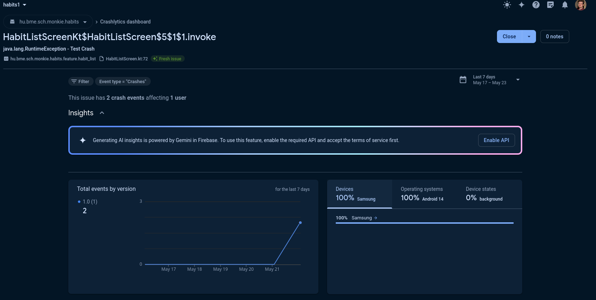
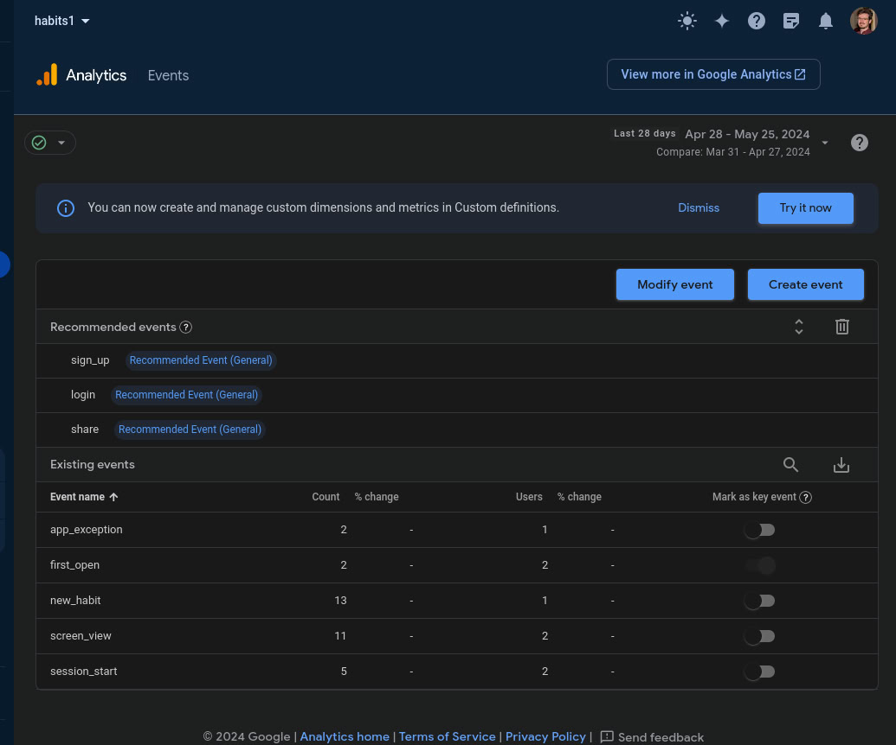

# Házi feladat specifikáció
## Mobilszoftver Laboratórium
### 2024.03.18

## Habits With Timestamps

## Bemutatás

Az alkalmazás egy ismétlődő, vagy megfigyelni kívánt szokásokat naplózó eszköz lenne. Az ötlet onnan jött, hogy szerettem volna követni bizonyos szokásokat időbélyegekkel, például reggeli ébredés időpontja, kávézások, allergia gyógyszer bevétel,... Mindezeket egyszerűen, gyorsan lehetne rögzíteni egy Androidos mobilon. Olyan embereknek lehetne hasznos, akik ilyesmiket szeretnének számon tartani, vagy azoknak akik picit feledékenyebbek.

## Főbb funkciók

Az alkalmazással __szokásokat__ tudunk felvenni, törölni, szerkeszteni. Ezek egy listában megtekinthetőek, és érintésre, jobbra, balra húzásra más-más interakciót lehet velük végezni. Az egyes szokásokhoz időbélyeges __alkalmakat__ vehetünk fel, azzal az időponttal, amikor azok bekövetkeztek. Ezeket az alkalmakat szerkeszthetjük, visszavonhatjuk, vagy akár más időponttal is felvehetjük, mint a jelenlegi pontos idő. 

Az alkalmak részletei külön nézetben megtekinthetőek. Megnézhetjük a teljes listát pontos időpontokkal, az egyes alkalmak között eltelt időt, statisztikákat, mint jellemző időpont a nap során, átlagos alkalom per nap vagy hét,... Az egyes alkalmakhoz külső adatforrásból, ha az internet kapcsolat rendelkezésre áll, az aktuális hőmérséklet és láthatóság is hozzárendelésre kerül. Erre az [OpenWeatherMap API-ját](https://openweathermap.org/api) fogom használni. Az utóbbi adatokból is szerepelhetnek átlagok a részletes nézetben.

A szokások és az alkalmak elérhetőek offline, lokális adatbázisban kerülnek tárolásra. 

 ### Use-case-ek leírása:
 - Új szokás felvétele
   - A **felhasználó** a beállításokban felvesz egy új szokást, ami ezután megjelenik a főképernyőn.
 - Meglévő szokás szerkesztése
   - A **felhasználó** a beállításokban a már meglévő szokás nevét átírhatja.
 - Meglévő szokás törlése
   - A **felhasználó** a beállításokban a már meglévő szokást törölheti.
 - Meglévő szokások sorrendjének módosítása
   - A **felhasználó** fel-le gombokkal változtathatja a meglévő szokások sorrendját.
   - _A végleges implementációban lehet nem fel-le gombokkal fogom megvalósítani, ha találok kivételezőhető, jobb megoldást._
 - Új alkalom felvétele
   - A **felhasználó** egy szokás megérintésével új alkalmat hoz létre az aktuális időponttal.
   - Ha az internet és lokáció elérhető, akkor az **OpenWeatjerAPI**-val az aktuális hőmérséklet és láthatóság is az alkalomban rögzítésre kerül.
 - Legutóbbi alkalom visszavonása
   - A megfelelő interakcióval a szokáson a legutóbb felvett alkamat törölheti a **felhasználó**.
 - Alkalmak szerkesztése
   - A **felhasználó** a részletes nézetből elnavigálhat a szokás teljes listájához és itt szerkesztésre kiválaszthat egy alkalmat. A megfelelő interakcióval egy felugró Fragment-ben megadhat egy másik dátumot.
   - Ha az internet és lokáció elérhető, és egy másik felugró Fragmentben a **felhasználó** megadhatja a lokációt, ekkor az **OpenWeatjerAPI** segítségével az alkalomban rögzítésre kerül a hőmérséklet és láthatóság.
   - Ugyanakkor a **felhasználó** itt törlésre is kiválaszthat egy alkalmat.
 - Alkalmak és statisztikák megtekintése
   - A megfelelő interakcióval a **felhasználó** az alkalmazás részletes nézetében ezeket megtekintheti.

## Képernyőtervek

### Listanézet
Az alkalmazás egy lista nézetben jeleníti meg a már felvett szokásokat. Egy lista elemmel többféle módon lehet interaktálni.
- Megérintve egy új időbélyeges bejegyzés kerül a pontos időponttal az adott szokáshoz.
- Ha hosszan érintjük meg, akkor megnyílik a részletes nézete a szokásnak.
- Ha balra húzzuk, akkor a legutóbbi bejegyzés törölhető.
Utóbbi kettő még nem biztos, hogy pontosan ilyen módon lesz kiosztva, de ezekre az interkaciókra ezek a reakciók fognak bekövetkezni valamilyen permutációban.

### Részletes nézet
A részeletes nézetben megtekinthetjük egy rövidebb listáját az eddigi bejegyzéseknek, például 3 elemet és az ezek között eltelt időt. A teljes listát az adott gomb érintésére megtekinthetjük. A rövidebb lista alatt láthathunk még statisztikát az adott szokásról, mint azt a Főbb funkcióknál leírtam.

### Részletes nézeten belüli nézet
Itt csupán megtekinthetjük egy hosszú listában az összes bejegyzést és szerkeszhetjük azok időpontjait.

### Beállítások
Itt szerkeszthetőek, törölhetőek, létrehozhatóak a szokások maguk. Emellett a sorrendjük is módosítató. 

# Házi feladat architektúra és környezet

Az MVVM architektúrát választottam, mivel a labor kiírásában ez szerepelt ajánlottként, valamint mivel a Google által is jelenleg ez az ajánlott architektúra. Az ajánlás mentén a felhasználói felület és az adatok egyértelműen szétválaszthatóak, de könnyű kezelés mellett hivatkozhatnak egymásra. 

# Házi feladat Hálózat és adatbázis
Jelenleg a HabitViewModel van a MainActivitybe helyezve. Előbbiben nem a végleges működés, hanem egy teszt van megvalósítva arra, hogy az API kérés működik-e. **Sajnos a beadás pillanatában a kérés maga működik, viszont a lokáció lekérése a telefontól nem.** Ezért a hálózati lekérés fixen Budapest koordinátáit használja.

A google.json és az OpenWeather API kulcsa szükségesek a működéshez. Viszont mivel nem találtam jobb megoldást az elrejtésükre végül plaintext belekerültek a repoba. Ezeket egy saját repoban secretekként hozzáadhatom a projekthez, de jelenleg remélem ez nem számít hibának.

### Hálózati hívások API leírása

Mivel csak egy API hívásom van az OpenWeatherMap felé, így csak azt írtam le az api.yaml fájlban. Ez egy Get hívás, a megfelelő koordinátákkal. Az API kulcsomat, egy nálam jelentősen tapasztaltabbb szaktársam tanácsára a BuildConfig elem által tettem elérhetővé, így az kevésbé kitett. A többnyire beszédes mezőket, amik az időjárás leírására szolgálnak nem fejtettem ki. Esetünkben igazából csak a main blokkon belüli temp mező lesz érdekes az aktuális hőmérséklet miatt.

### Hálózati réteg elkészítése:

- `ApiClient`
    - Ezzel az objektummal tudunk egy Retrofit build segítségével egy API klienst létrehozni. Ebbe helyeztem el az alap url-t is. Az itteni osztályt később a dependcy injection-nel elérhetjük a megfelelő Provides használa miatt.
- `Location`
    - Ez az osztály a hálózati kommunikációtól független, viszont ahhoz szükséges adatok lekérésre szolgál, így ugyanabba a package-be raktam. A dependecy injection segítségével itt a külső FusedLocationProviderClient kerül injectálásra. **Valamiért az ebben megvalósított metódus jelenleg nem működik megfelelően.**
    - Mellesleg itt került leírásra egy egyszerű koordináta osztály is, retLoc néven, ami a hosszúságot és szélességet tartalmazza.
- `NetworkWeather`
    - Az API lekérésnél visszaadott adatokat kiszűrő adat osztály. A mezői mivel a hálózati kommunikációból a válasz json-ben lesz, így szerializált annotációval láttam el.
- `WeatherApi`
    - A lekéréshez szükséges Retrofit-es interfész. A megfelelő path mellett a szükséges query-kkel van ellátva. Ennek bekötése a DatesRepository-ban történik meg.

### ORM adatréteg elkészítése:
#### Entity
- `LocalHabit`
    - Az alkalmazásban szereplő szokásokat reprezentáló entitás. Alapvetően egy nevet és egy sorszámot tartalmaz, mivel ugye rendezhetőek.
- `LocalDate`
    - Az alkalmazásban szereplő alkalmakat reprezentáló entitás. Egy szokás azonosítót tartalmaz, amihez tartozik, valamint egy Nullable hőmérséletet. Ami akkor üres, ha nem áll rendelkezésre az információ.
#### DAO
Ezek a komponensek az adatbázis műveletekért könnyű elérésért felelnek. A könnyebb kezelhetőség végett a hozzájuk tartozó Entitykkel egy fájlba kerültek. Ha ez nem megfelelő a következő beadásnál korrigálom.
- `HabitDao`
    - Az alkalmazásban szereplő szokásokat reprezentáló entitásokat kezelő DAO. A delete, add metódusokat is Query-kkel valósítottam meg, mert ezt tűnt a célra vezetőbb megoldásnak.
- `DatesDao`
    - Az alkalmazásban szereplő alkalmakat reprezentáló entitásokat kezelő DAO. Csak a delete metódust valósítottam meg Query-vel.
#### Database
- `AppDatabase`
    - Room adatbázis osztály, amely tartalmazza a DAO-kat. Fontos kiemelni, hogy annotálva van a következő konvertáló osztály is!
- `Converters`
    - Az osztály arra szolgál, hogy a Room adatbázisban lehessen időpontokat is tárolni. Ezt úgy teszi lehetővé, hogy a megfelelő metódusok definiálásával a komplex DateTime formátumot Long-á alakítja, ami a Room számára már ismert.
#### Repository
- `HabitRepository, DefaultHabitRepository`
    - Az adatbázis és a ViewModel közötti kapcsolatot biztosító osztály. Különösebb extra logika nincsen benne, amit elfedne.
- `DatesRepository, DefaultDateRepository`
    - Az adatbázis és a ViewModel közötti kapcsolatot biztosító osztály. Itt kellett a hálózati lekérésre szolgáló API osztályt meghívni, valamint a bonyolultabb lokációs lekérést is lekezelni. Itt a dependency injection segítségével az API kliens a lokációval együtt elérhetővé válik.
#### DI keretrendszer
- `ApiModule`
    - Az alkalmazásban mások számára lokációhoz szükséges rendszerközeli osztályokat biztosító osztály.
- `DatabaseModule`
    - Az adatbázist és a DAO-kat más osztályok számára biztosító osztály.
- `DataModule, vagyis DateModule, HabitModule`
  - A Repositoryk injektálhatóságára szolgáló fájl. Itt a megfelelő annotációk segítségével a ViewModel-ek is hozzáférhetnek a megfelelő Repository-khoz.

# Házi feladat Felhasználói felület videó

Végül 6 perc lett ezért elnézést, nagyon nehézkes volt a videó elkészítése.
[Video link](https://bmeedu-my.sharepoint.com/:v:/g/personal/szenczy_balazs_edu_bme_hu/ERJm_LlCGVtJgWFrgPhK_y8BfAeSnSEos9Z1gCHCrsscWw?nav=eyJyZWZlcnJhbEluZm8iOnsicmVmZXJyYWxBcHAiOiJPbmVEcml2ZUZvckJ1c2luZXNzIiwicmVmZXJyYWxBcHBQbGF0Zm9ybSI6IldlYiIsInJlZmVycmFsTW9kZSI6InZpZXciLCJyZWZlcnJhbFZpZXciOiJNeUZpbGVzTGlua0NvcHkifX0&e=I2RPLM)

# Tesztelés

## Crashlitics integráció
A Crashlitics kipróbáláshoz a kezdő oldal toolbarjához adtam egy dedikált crash gombot. Mint látszik meg is tudott jelenni.

## Analytics integráció
Sajnos próbáltam javítani a Firebase Analytics-et, de úgy tűnt nem működött. A következő parancsokkal próbáltam kilogolni.
adb shell setprop log.tag.FA VERBOSE                                                                                                                                                                                              
adb shell setprop log.tag.FA-SVC VERBOSE                                                                                                                                                                                         
adb logcat -v time -s FA FA-SVC 
De itt a következő hibaüzenet volt:
java.net.ConnectException: Failed to connect to app-measurement.com/0.0.0.0:443: btlq.run(:com.google.android.gms@242013038@24.20.13 (190400-633713831):179)

Viszont végül több, mint 24 órán belül megjelentek az üzenteket, így végül nem teljesen értettem mi lehet a baj. (Logolt eventként egy új habit felvételét állítottam be.)

## Tesztelési terv

A tesztelésnél a kiadott anyagok alapján alapvetően a ViewModeleket kell tesztelnem, valamint adatrétegnél a repositorykat. A DateRepository Converter-ét
is érdemes lehet tesztelni, bár nem tudom hogyan. Viszont a HabitListViewModel és a HabitDetailedViewModelben sajnos figyelmetlenségből átadtam a Contextet, így azokhoz szükség
lesz egy futtató eszközre, vagy is azokat nem sima hanem androidTestként kell létrehozni.

A repositroyk esetében próbáltam minden metódus köré egy egyszerű tesztet írni. 

Hasonló lett volna a célom a ViewModelek-nél is, de a rendelkezésre álló anyagok alapján saját alkalmatlanságból képtelen voltam
működésre bírni a teszteket. Így végül azokhoz nem készültek tesztek.

