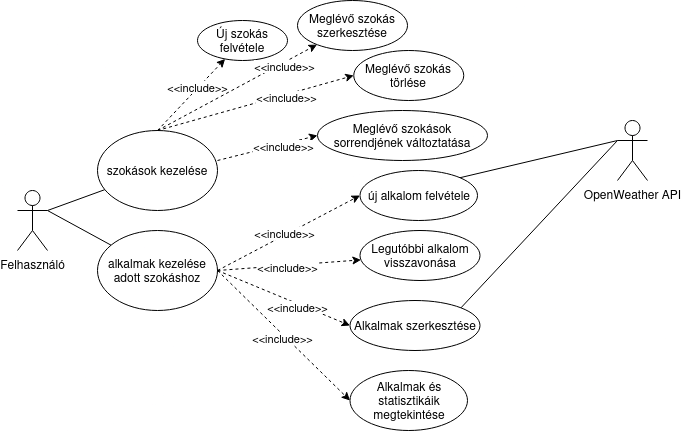
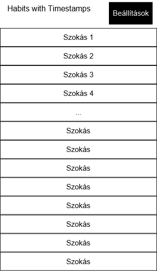
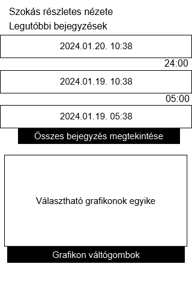
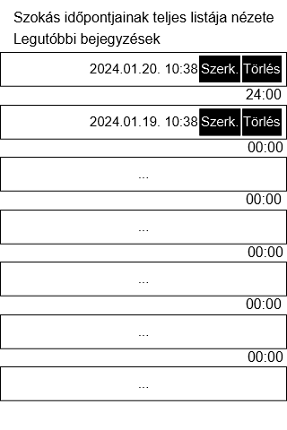
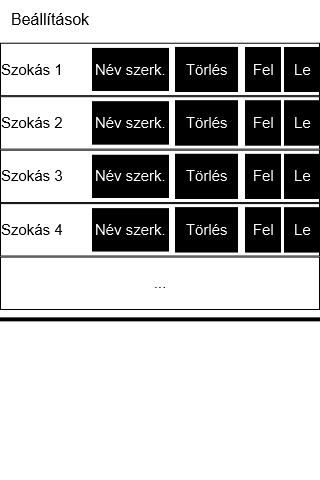
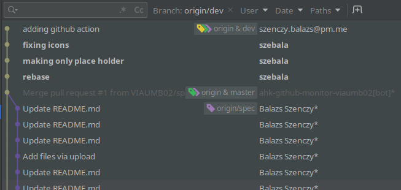
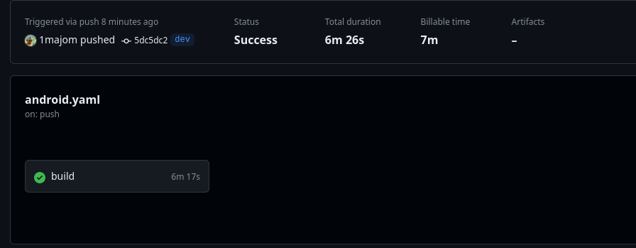

# Házi feladat specifikáció
## Mobilszoftver Laboratórium
### 2024.03.18

## Habits With Timestamps

## Bemutatás

Az alkalmazás egy ismétlődő, vagy megfigyelni kívánt szokásokat naplózó eszköz lenne. Az ötlet onnan jött, hogy szerettem volna követni bizonyos szokásokat időbélyegekkel, például reggeli ébredés időpontja, kávézások, allergia gyógyszer bevétel,... Mindezeket egyszerűen, gyorsan lehetne rögzíteni egy Androidos mobilon. Olyan embereknek lehetne hasznos, akik ilyesmiket szeretnének számon tartani, vagy azoknak akik picit feledékenyebbek.

## Főbb funkciók

Az alkalmazással __szokásokat__ tudunk felvenni, törölni, szerkeszteni. Ezek egy listában megtekinthetőek, és érintésre, jobbra, balra húzásra más-más interakciót lehet velük végezni. Az egyes szokásokhoz időbélyeges __alkalmakat__ vehetünk fel, azzal az időponttal, amikor azok bekövetkeztek. Ezeket az alkalmakat szerkeszthetjük, visszavonhatjuk, vagy akár más időponttal is felvehetjük, mint a jelenlegi pontos idő. 

Az alkalmak részletei külön nézetben megtekinthetőek. Megnézhetjük a teljes listát pontos időpontokkal, az egyes alkalmak között eltelt időt, statisztikákat, mint jellemző időpont a nap során, átlagos alkalom per nap vagy hét,... Az egyes alkalmakhoz külső adatforrásból, ha az internet kapcsolat rendelkezésre áll, az aktuális hőmérséklet és láthatóság is hozzárendelésre kerül. Erre az [OpenWeatherMap API-ját](https://openweathermap.org/api) fogom használni. Az utóbbi adatokból is szerepelhetnek átlagok a részletes nézetben.

A szokások és az alkalmak elérhetőek offline, lokális adatbázisban kerülnek tárolásra. 

 ### Use-case-ek leírása:
 - Új szokás felvétele
   - A **felhasználó** a beállításokban felvesz egy új szokást, ami ezután megjelenik a főképernyőn.
 - Meglévő szokás szerkesztése
   - A **felhasználó** a beállításokban a már meglévő szokás nevét átírhatja.
 - Meglévő szokás törlése
   - A **felhasználó** a beállításokban a már meglévő szokást törölheti.
 - Meglévő szokások sorrendjének módosítása
   - A **felhasználó** fel-le gombokkal változtathatja a meglévő szokások sorrendját.
   - _A végleges implementációban lehet nem fel-le gombokkal fogom megvalósítani, ha találok kivételezőhető, jobb megoldást._
 - Új alkalom felvétele
   - A **felhasználó** egy szokás megérintésével új alkalmat hoz létre az aktuális időponttal.
   - Ha az internet és lokáció elérhető, akkor az **OpenWeatjerAPI**-val az aktuális hőmérséklet és láthatóság is az alkalomban rögzítésre kerül.
 - Legutóbbi alkalom visszavonása
   - A megfelelő interakcióval a szokáson a legutóbb felvett alkamat törölheti a **felhasználó**.
 - Alkalmak szerkesztése
   - A **felhasználó** a részletes nézetből elnavigálhat a szokás teljes listájához és itt szerkesztésre kiválaszthat egy alkalmat. A megfelelő interakcióval egy felugró Fragment-ben megadhat egy másik dátumot.
   - Ha az internet és lokáció elérhető, és egy másik felugró Fragmentben a **felhasználó** megadhatja a lokációt, ekkor az **OpenWeatjerAPI** segítségével az alkalomban rögzítésre kerül a hőmérséklet és láthatóság.
   - Ugyanakkor a **felhasználó** itt törlésre is kiválaszthat egy alkalmat.
 - Alkalmak és statisztikák megtekintése
   - A megfelelő interakcióval a **felhasználó** az alkalmazás részletes nézetében ezeket megtekintheti.

## Képernyőtervek

### Listanézet
Az alkalmazás egy lista nézetben jeleníti meg a már felvett szokásokat. Egy lista elemmel többféle módon lehet interaktálni.
- Megérintve egy új időbélyeges bejegyzés kerül a pontos időponttal az adott szokáshoz.
- Ha hosszan érintjük meg, akkor megnyílik a részletes nézete a szokásnak.
- Ha balra húzzuk, akkor a legutóbbi bejegyzés törölhető.
Utóbbi kettő még nem biztos, hogy pontosan ilyen módon lesz kiosztva, de ezekre az interkaciókra ezek a reakciók fognak bekövetkezni valamilyen permutációban.

### Részletes nézet
A részeletes nézetben megtekinthetjük egy rövidebb listáját az eddigi bejegyzéseknek, például 3 elemet és az ezek között eltelt időt. A teljes listát az adott gomb érintésére megtekinthetjük. A rövidebb lista alatt láthathunk még statisztikát az adott szokásról, mint azt a Főbb funkcióknál leírtam.

### Részletes nézeten belüli nézet
Itt csupán megtekinthetjük egy hosszú listában az összes bejegyzést és szerkeszhetjük azok időpontjait.

### Beállítások
Itt szerkeszthetőek, törölhetőek, létrehozhatóak a szokások maguk. Emellett a sorrendjük is módosítató. 

# Házi feladat architektúra és környezet

Az MVVM architektúrát választottam, mivel a labor kiírásában ez szerepelt ajánlottként, valamint mivel a Google által is jelenleg ez az ajánlott architektúra. Az ajánlás mentén a felhasználói felület és az adatok egyértelműen szétválaszthatóak, de könnyű kezelés mellett hivatkozhatnak egymásra. 

